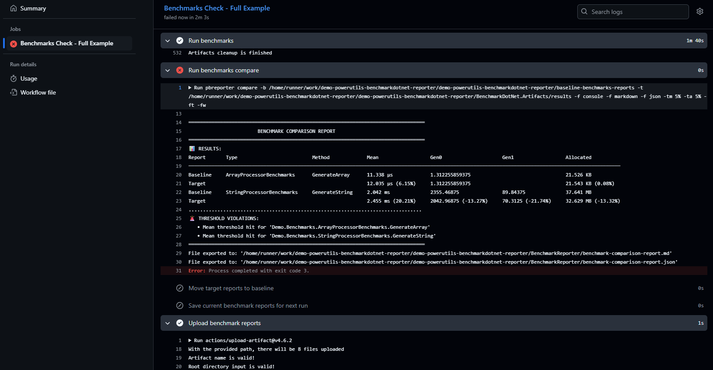
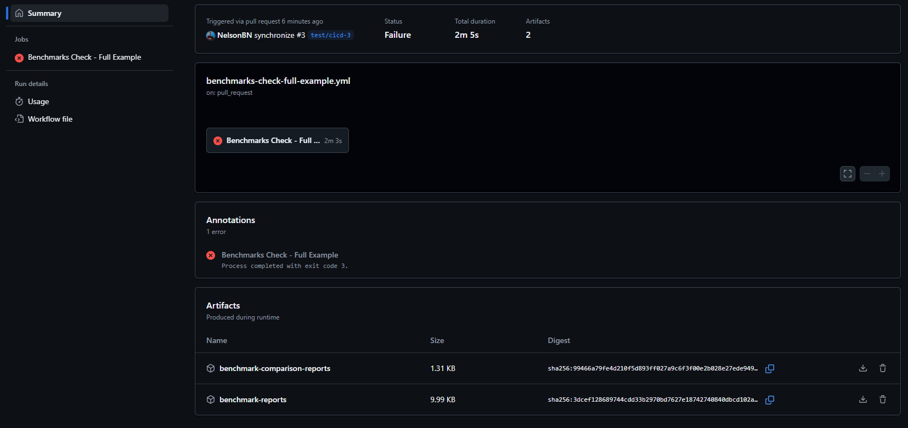
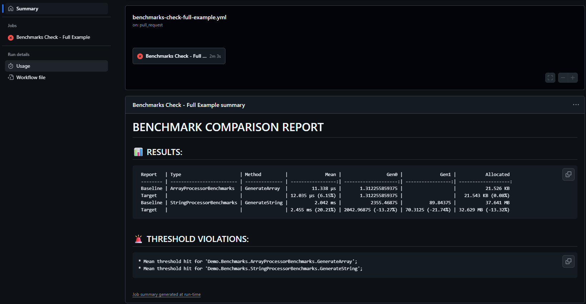
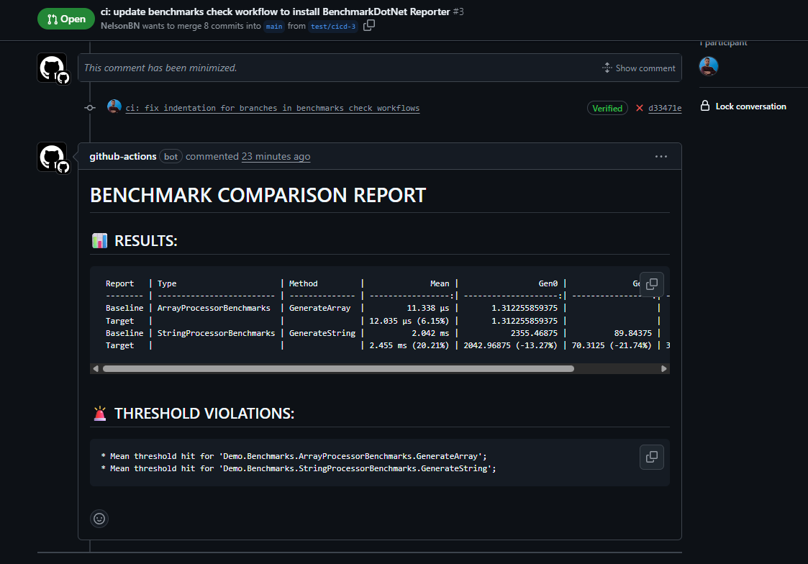

# GitHub Actions Setup Guide

This guide explains how to configure `PowerUtils.BenchmarkDotnet.Reporter` in a CI/CD pipeline using GitHub Actions to automatically analyze and compare benchmark performance between baseline and target reports.


## Overview

- Runs benchmarks on pull requests
- Compares current results with baseline reports
- Caches baseline reports for future comparisons
- Publishes comparison reports as PR comments and job summaries
- Uploads artifacts for historical analysis


## Configurations

### Minimal configuration

```yaml
name: 'Benchmarks Check'

on:
  workflow_dispatch:
  pull_request:
    types: [opened, reopened, edited, synchronize]
    branches:
      - main

env:
  PATH_BENCHMARKS_PROJECT: 'tests/Demo.Benchmarks/Demo.Benchmarks.csproj'
  DIR_BASELINE_REPORTS: 'baseline-benchmarks-reports'
  DIR_TARGET_REPORTS: 'BenchmarkDotNet.Artifacts/results'
  CACHE_KEY: 'baseline-benchmarks-reports'
  THRESHOLD_MEAN: 5%
  THRESHOLD_ALLOCATION: 5%

jobs:
  benchmarks-check:
    name: 'Benchmarks Check'
    runs-on: 'ubuntu-latest'

    steps:
    - name: 'Checkout'
      uses: actions/checkout@v4.2.2

    - name: 'Setup .NET'
      uses: actions/setup-dotnet@v4.3.1
      with:
        dotnet-version: '9.x.x'

    - name: 'Restore Baseline benchmark reports'
      uses: actions/cache/restore@v4
      id: cache
      with:
        path: ${{ github.workspace }}/${{ env.DIR_BASELINE_REPORTS }}
        key: ${{ env.CACHE_KEY }}

    - name: 'Install PowerUtils.BenchmarkDotnet.Reporter'
      if: steps.cache.outputs.cache-matched-key != ''
      run: dotnet tool install --global PowerUtils.BenchmarkDotnet.Reporter

    - name: 'Restore dependencies'
      run: dotnet restore

    - name: 'Build projects'
      run: dotnet build -c Release --no-restore ${{ github.workspace }}/${{ env.PATH_BENCHMARKS_PROJECT }}

    - name: 'Run benchmarks'
      run: dotnet run -p ${{ github.workspace }}/${{ env.PATH_BENCHMARKS_PROJECT }} -c Release

    - name: 'Run benchmarks compare'
      if: steps.cache.outputs.cache-matched-key != ''
      run: pbreporter compare -b ${{ github.workspace }}/${{ env.DIR_BASELINE_REPORTS }} -t ${{ github.workspace }}/${{ env.DIR_TARGET_REPORTS }} -f console -tm ${{ env.THRESHOLD_MEAN }} -ta ${{ env.THRESHOLD_ALLOCATION }} -ft -fw

    - name: 'Move target reports to baseline'
      run: |
        echo "Moving target reports to baseline reports"
        rm -rf ${{ github.workspace }}/${{ env.DIR_BASELINE_REPORTS }}
        mv ${{ github.workspace }}/${{ env.DIR_TARGET_REPORTS }} ${{ github.workspace }}/${{ env.DIR_BASELINE_REPORTS }}

    - name: 'Save current benchmark reports for next run'
      uses: actions/cache/save@v4
      with:
        path: ${{ github.workspace }}/${{ env.DIR_BASELINE_REPORTS }}
        key: ${{ env.CACHE_KEY }}-${{ github.run_number }}
```

### Cache

The cache is important for storing baseline benchmarks from previous runs, allowing comparisons against current benchmarks. It is recommended to use different actions for restoring and saving the cache. This approach provides flexibility in controlling when the cache should be updated. For example, you might want to only update the cache when the current benchmarks don't throw any warnings or hit the thresholds by adding appropriate conditions to the cache save step.

```yaml
...

env:
  DIR_BASELINE_REPORTS: 'baseline-benchmarks-reports'
  DIR_TARGET_REPORTS: 'BenchmarkDotNet.Artifacts/results'
  CACHE_KEY: 'baseline-benchmarks-reports'


jobs:
  benchmarks-check:
    ...

    steps:
    ...

    - name: 'Restore Baseline benchmark reports'
      uses: actions/cache/restore@v4
      id: cache
      with:
        path: ${{ github.workspace }}/${{ env.DIR_BASELINE_REPORTS }}
        key: ${{ env.CACHE_KEY }}

    ...

    - name: 'Move target reports to baseline'
      run: |
        echo "Moving target reports to baseline reports"
        rm -rf ${{ github.workspace }}/${{ env.DIR_BASELINE_REPORTS }}
        mv ${{ github.workspace }}/${{ env.DIR_TARGET_REPORTS }} ${{ github.workspace }}/${{ env.DIR_BASELINE_REPORTS }}

    - name: 'Save current benchmark reports for next run'
      uses: actions/cache/save@v4
      with:
        path: ${{ github.workspace }}/${{ env.DIR_BASELINE_REPORTS }}
        key: ${{ env.CACHE_KEY }}-${{ github.run_number }}
```
> Move the target reports to baseline after the comparison step, ensuring that the next run has the latest baseline reports available for comparison. Note that in this example, the cache is always updated regardless of threshold violations. You can add additional conditions to the cache save step if you want to only update the cache when no thresholds are violated.



### Cache Id

The cache Id is useful to prevent executing actions when it isn't possible to restore the baseline reports. This can happen on the first run.

**Example**:

```yaml
...

jobs:
  benchmarks-check:
    ...

    steps:
    ...

    - name: 'Restore Baseline benchmark reports'
      uses: actions/cache/restore@v4
      id: cache
      with:
        path: ${{ github.workspace }}/${{ env.DIR_BASELINE_REPORTS }}
        key: ${{ env.CACHE_KEY }}

    - name: 'Install PowerUtils.BenchmarkDotnet.Reporter'
      if: steps.cache.outputs.cache-matched-key != ''
      run: dotnet tool install --global PowerUtils.BenchmarkDotnet.Reporter

    ...

    - name: 'Run benchmarks compare'
      if: steps.cache.outputs.cache-matched-key != ''
      run: pbreporter compare -b ${{ github.workspace }}/${{ env.DIR_BASELINE_REPORTS }} -t ${{ github.workspace }}/${{ env.DIR_TARGET_REPORTS }} -f console -tm ${{ env.THRESHOLD_MEAN }} -ta ${{ env.THRESHOLD_ALLOCATION }} -ft -fw

    ...
```

> In the example above, the `Run benchmarks compare` step will only execute if the cache was successfully restored. The tool is installed unconditionally since it might be needed for other purposes or future runs.


### Tool Installation

You can configure GitHub Actions to use either local or global tool installation:

#### Option 1: Using Local Tool Installation

```yaml
...

jobs:
  benchmarks-check:
    ...

    steps:
    ...

    - name: 'Restore .NET Tools'
      run: dotnet tool restore

    ...

    - name: 'Run benchmarks compare'
      run: dotnet pbreporter compare -b ${{ github.workspace }}/baseline-benchmarks-reports -t ${{ github.workspace }}/BenchmarkDotNet.Artifacts/results -f console
```

#### Option 2: Using Global Tool Installation

```yaml
...

jobs:
  benchmarks-check:
    ...

    steps:
    ...

    - name: 'Install PowerUtils.BenchmarkDotnet.Reporter'
      run: dotnet tool install --global PowerUtils.BenchmarkDotnet.Reporter

    - name: 'Run benchmarks compare'
      run: pbreporter compare -b ${{ github.workspace }}/${{ env.DIR_BASELINE_REPORTS }} -t ${{ github.workspace }}/${{ env.DIR_TARGET_REPORTS }} -f console -f markdown -f json
```

> NOTE: When using local tool installation, it is necessary to use the `dotnet pbreporter ...` command instead of the `pbreporter ...` command to ensure the tool is executed correctly within the context of the project.


### Upload comparison results

Sometimes, you may want to consult the comparison results after the workflow has completed. You can use the `actions/upload-artifact` action to upload the comparison results as artifacts.

```yaml
...

env:
  DIR_COMPARE_REPORTS: 'BenchmarkReporter'

jobs:
  benchmarks-check:
    ...

    steps:
    ...

    - name: 'Upload compare benchmark report'
      uses: actions/upload-artifact@v4.6.2
      if: steps.cache.outputs.cache-matched-key != '' && always()
      with:
        name: 'benchmark-comparison-reports'
        path: ${{ github.workspace }}/${{ env.DIR_COMPARE_REPORTS }}/*
        if-no-files-found: error
```

> The condition `steps.cache.outputs.cache-matched-key != ''` ensures that the upload step only runs if the comparison was executed. The `always()` function ensures that the upload step runs even if previous steps fail, allowing you to review the comparison results regardless of the outcome of the benchmarks.




### Publish results in GitHub Actions Summary

You can also publish the comparison results directly in the GitHub Actions summary. This is useful for quickly reviewing the results without needing to download artifacts.

```yaml
...

env:
  DIR_BASELINE_REPORTS: 'baseline-benchmarks-reports'
  DIR_TARGET_REPORTS: 'BenchmarkDotNet.Artifacts/results'
  DIR_COMPARE_REPORTS: 'BenchmarkReporter'

jobs:
  benchmarks-check:
    ...

    steps:
    ...

    - name: 'Run benchmarks compare'
      if: steps.cache.outputs.cache-matched-key != ''
      run: pbreporter compare -b ${{ github.workspace }}/${{ env.DIR_BASELINE_REPORTS }} -t ${{ github.workspace }}/${{ env.DIR_TARGET_REPORTS }} -f markdown

    ...

    - name: 'Publish benchmark report in Summary'
      if: steps.cache.outputs.cache-matched-key != '' && always()
      run: cat ${{ github.workspace }}/${{ env.DIR_COMPARE_REPORTS }}/benchmark-comparison-report.md > $GITHUB_STEP_SUMMARY
```

> The `GITHUB_STEP_SUMMARY` environment variable allows you to write directly to the summary of the GitHub Actions run, making it easy to review the results without leaving the workflow page. To publish the results in the summary, you should configure the `pbreporter compare` command to output the results in markdown format (`-f markdown`).
> The condition `steps.cache.outputs.cache-matched-key != ''` ensures that the summary is only updated if the comparison was executed. The `always()` function ensures that the summary update runs even if previous steps fail, allowing you to review the comparison results regardless of the outcome of the benchmarks.




### Publish results in Pull Request Comment

To have the best experience and facilitate the code review process, you can publish the comparison results in a pull request comment. This allows reviewers to see the benchmark results directly in the pull request.

```yaml
...


env:
  DIR_BASELINE_REPORTS: 'baseline-benchmarks-reports'
  DIR_TARGET_REPORTS: 'BenchmarkDotNet.Artifacts/results'
  DIR_COMPARE_REPORTS: 'BenchmarkReporter'


jobs:
  benchmarks-check:
    ...
    permissions:
      pull-requests: write

    steps:
    ...

    - name: 'Run benchmarks compare'
      if: steps.cache.outputs.cache-matched-key != ''
      run: pbreporter compare -b ${{ github.workspace }}/${{ env.DIR_BASELINE_REPORTS }} -t ${{ github.workspace }}/${{ env.DIR_TARGET_REPORTS }} -f markdown

    ...

    - name: 'Add compare benchmark report in PR Comment'
      uses: marocchino/sticky-pull-request-comment@773744901bac0e8cbb5a0dc842800d45e9b2b405
      if: github.event_name == 'pull_request' && steps.cache.outputs.cache-matched-key != '' && always()
      with:
        header: compare-benchmark-report
        hide_and_recreate: true
        hide_classify: "OUTDATED"
        path: ${{ github.workspace }}/${{ env.DIR_COMPARE_REPORTS }}/benchmark-comparison-report.md
```

> The `marocchino/sticky-pull-request-comment` action is used to add the comparison report in a pull request comment. The `hide_and_recreate: true` option ensures that the comment is updated with the latest results, and the `hide_classify: "OUTDATED"` option hides the comment if it is outdated.
> To comment on a Pull Request, the `permissions` section must be configured to allow writing to pull requests. This is necessary for the action to create or update comments on the pull request. `pull-requests: write` permission is required to allow the action to post comments on pull requests.
> The condition `github.event_name == 'pull_request'` ensures that the comment is only added when the workflow is triggered by a pull request event. The `steps.cache.outputs.cache-matched-key != ''` condition ensures that the comment is only added if the comparison was executed. The `always()` function ensures that the comment update runs even if previous steps fail, allowing you to review the comparison results regardless of the outcome of the benchmarks.




## Example workflows

- Minimal configuration: [examples/minimal.yml](https://github.com/NelsonBN/demo-powerutils-benchmarkdotnet-reporter/blob/main/.github/workflows/benchmarks-check-minimal-example.yml)
- Full example: [examples/full-example.yml](https://github.com/NelsonBN/demo-powerutils-benchmarkdotnet-reporter/blob/main/.github/workflows/benchmarks-check-full-example.yml)
